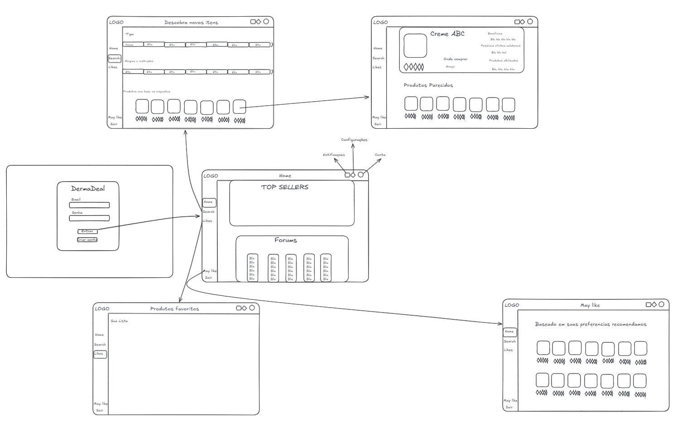
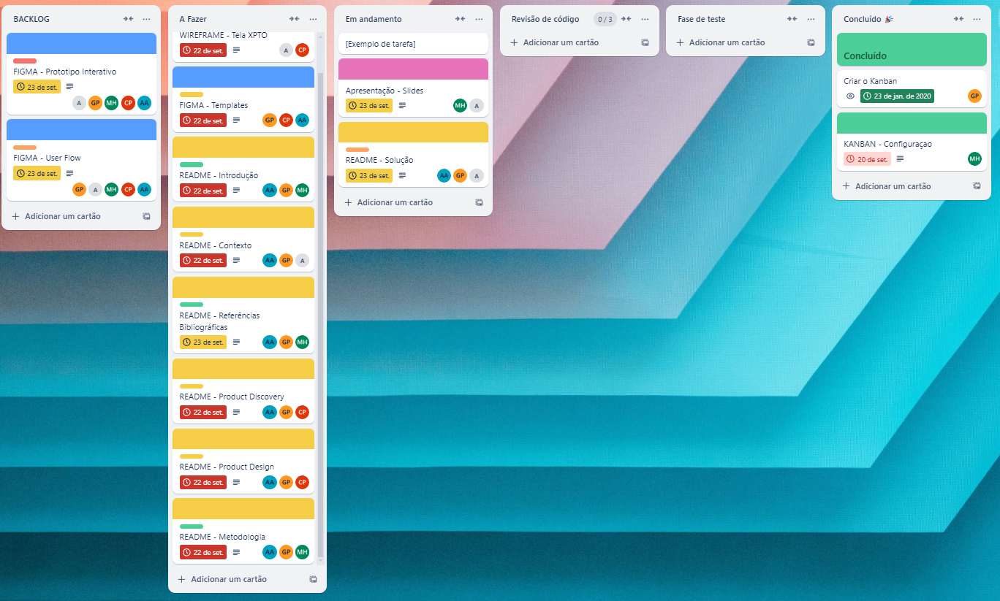

# Introdução

Informações básicas do projeto.

* **Projeto:** DermaDeal

* **Repositório GitHub:** [Repositorio](https://github.com/ICEI-PUC-Minas-PPLES-TI/plf-es-2024-2-ti1-0385100-tiaw-grupo-2)

## Alunos integrantes da equipe

  * [Carlos Eduardo Pamponet](https://github.com/Carlos-Eduardo-Pamponet);
  * [Ayla Assunção](https://github.com/aylaassuncao);
  * [Giuliano Percope](https://github.com/GiulianoLBP);
  * [Maria Carolina Heeren](https://github.com);
  * [Antônio Loureiro](https://github.com);

## Professores responsáveis

* Cleiton Silva Tavares
* Rommel Vieira Carneiro

A documentação do projeto é estruturada da seguinte forma:

1. Introdução
2. Contexto
3. Product Discovery
4. Product Design
5. Metodologia
6. Solução
7. Referências Bibliográficas

✅ [Documentação de Design Thinking (MIRO)](files/PPLES-M%20-%20Grupo%202%20-%20Informação%20produtos%20de%20cuidado%20pessoal.pdf)

# DermaDeal

Um projeto que visa resolver o problema da falta de informação sobre produtos de cuidado pessoal, em específico, produtos de cuidado da pele. Devido à grande demanda por produtos de "skincare", atualmente, os consumidores encontram uma oferta diversificada de produtos ao seu dispor em farmácias, lojas de cosméticos, lojas especializadas e muito mais.

Pela facilidade em encontrar produtos com diferentes funções, torna-se difícil entender quais produtos se encaixam nas necessidades do consumidor, principalmente a um valor acessível. Além disso, lidar com as influências de grandes marcas e de indivíduos divulgadores que fazem propagandas em redes sociais, utilizando marketing de produtos cada vez mais disfarçados de experiências reais, tem sido complexo. Esse cenário representa um risco para pessoas que têm sensibilidades na pele, assim como é maçante para a maior parte da população, que possui uma vida financeira razoável, gastar uma parte de sua renda com produtos que podem não funcionar de acordo com suas prioridades, resultando em descartes.

Nosso objetivo é trazer informações concretas de forma simples para esses consumidores, para que o processo seja sem muitas complexidades e que vá satisfazer o cliente. Isso será feito por meio de um site que envolva pesquisas específicas com respostas detalhadas sobre produtos, sua composição e suas funcionalidades.

# Contexto

Um projeto que visa auxiliar na resolução do problema da falta de informações sobre produtos de cuidado pessoal, especificamente produtos de cuidado da pele. Nosso objetivo é fornecer informações concretas de forma simples para os consumidores, tornando o processo menos complexo e satisfatório. A solução será um site que oferece pesquisas específicas, com respostas detalhadas sobre produtos de skincare, suas composições e funcionalidades.

Nosso público-alvo é amplo, abrangendo as faixas etárias de jovens adultos (18-30 anos) e adultos (31-60 anos), incluindo pessoas com peles sensíveis ou com questões específicas, que encontram dificuldades na escolha de produtos que atendam seus requisitos e sejam acessíveis em termos de custo-benefício.

## Problema

Devido à grande demanda por produtos de skincare, atualmente os consumidores encontram uma oferta diversificada de produtos disponíveis em farmácias, lojas de cosméticos, lojas especializadas e muito mais. Com a facilidade de encontrar produtos com diferentes funções, torna-se difícil entender quais deles se encaixam nas necessidades do consumidor, principalmente em relação a um preço acessível.

Além disso, lidar com as influências de grandes marcas e indivíduos divulgadores que fazem propagandas em redes sociais, utilizando marketing de produtos cada vez mais disfarçados de experiências reais, tem sido complexo. Isso representa um risco para pessoas que têm sensibilidades na pele e é maçante para a maior parte da população, que possui uma vida financeira razoável, gastar uma parte de sua renda com produtos que podem não funcionar de acordo com suas prioridades, acabando por serem descartados.

A busca por informações que auxiliem na escolha correta desses produtos que atendam às necessidades dos consumidores é o maior empecilho nesse processo. Para atender às pessoas que estão à procura da rotina ideal para melhorar a sua pele, de forma que não tome tempo excessivo e que caiba em seus orçamentos, proporcionalmente à quantidade dos produtos presentes nas embalagens, desenvolvemos um projeto que agrupe essas informações e as coloque à disposição do cliente.

## Objetivos

O projeto tem como objetivo principal desenvolver um site que funcione como uma plataforma integrada para auxiliar consumidores na escolha de produtos de skincare. Em um mercado saturado e repleto de opções, nossa proposta é simplificar o processo de decisão, oferecendo informações claras e acessíveis sobre produtos, suas funções e composições. Buscamos criar um ambiente onde os usuários possam encontrar recomendações personalizadas, educar-se sobre cuidados com a pele e compartilhar experiências, tudo isso de forma a respeitar suas necessidades financeiras e garantir a segurança dos produtos escolhidos. Ao promover a transparência e a informação, almejamos empoderar os consumidores a tomarem decisões mais conscientes e assertivas em relação aos cuidados com sua pele.

### Objetivos específicos:

- **Criação de um Banco de Dados de Produtos** Desenvolver uma base de dados abrangente que inclua informações detalhadas sobre uma ampla gama de produtos de skincare, categorizando-os por tipo, função, composição e faixa de preço, facilitando a busca e a comparação entre eles.

- **Avaliação de Produtos por Usuários:** Implementar um sistema de avaliação e comentários, onde os usuários podem compartilhar suas experiências com os produtos, permitindo uma visão mais realista e colaborativa sobre a eficácia dos mesmos.

- **Interface Intuitiva e Acessível:** Desenvolver um design de site que seja amigável e acessível, garantindo que todos os usuários, independentemente de sua familiaridade com tecnologia, consigam navegar facilmente e encontrar as informações desejadas.

- **Parcerias com Especialistas:** Formar parcerias com dermatologistas e especialistas em skincare para validar informações e recomendações, oferecendo aos usuários uma fonte confiável e profissional.

- **Promoção de Produtos Acessíveis:** Focar na seleção de produtos que ofereçam uma boa relação custo-benefício, destacando opções acessíveis que não comprometam a qualidade, ajudando os consumidores a otimizar seus investimentos em cuidados com a pele.

## Justificativa

A escolha de desenvolver um site que facilite a escolha de produtos de skincare é justificada pela crescente demanda e complexidade desse mercado. Em 2021, o mercado global de cuidados com a pele foi avaliado em aproximadamente 148,3 bilhões de dólares e espera-se que alcance 189,3 bilhões de dólares até 2025, crescendo a uma taxa anual de 5,3% (Fonte: Grand View Research, 2021). Esse crescimento é impulsionado pela maior conscientização sobre cuidados pessoais e pela influência das redes sociais, onde influenciadores frequentemente promovem produtos sem a devida transparência sobre suas experiências.

Além disso, estudos indicam que aproximadamente 40% dos consumidores têm dificuldades em escolher produtos adequados às suas necessidades (Fonte: Statista, 2022). Essa incerteza é ainda mais preocupante para pessoas com pele sensível, que podem ter reações adversas a produtos inadequados. A falta de informação confiável e acessível pode levar a gastos desnecessários, resultando em produtos descartados que não atendem às expectativas dos consumidores.

A solução proposta, ao consolidar informações sobre produtos e oferecer recomendações personalizadas, é essencial para enfrentar esses desafios. Ao criar um espaço onde os usuários possam acessar conteúdos educacionais e avaliar produtos com base em experiências reais, buscamos não apenas simplificar a jornada de compra, mas também promover escolhas informadas e seguras. Isso não só beneficiará os consumidores, mas também contribuirá para a transparência e confiança no mercado de skincare.

## Público-Alvo

O público-alvo do nosso projeto é diversificado, abrangendo diferentes perfis de consumidores que buscam informações e produtos de skincare. Abaixo, descrevemos alguns dos principais perfis que utilizarão a aplicação:

### 1. Jovens Adultos (18-30 anos)

- **Conhecimentos Prévios:** Este grupo tende a ter algum conhecimento sobre cuidados com a pele, influenciado por redes sociais e influenciadores digitais.
- **Relação com a Tecnologia:** Usuários familiarizados com tecnologia, utilizam smartphones e redes sociais regularmente para pesquisar e comprar produtos.
- **Necessidades:** Buscam produtos acessíveis e eficazes, além de informações sobre ingredientes e rotinas de cuidados.
- **Relações Hierárquicas:** Geralmente independentes, mas podem buscar recomendações de amigos e influenciadores.

### 2. Adultos (31-60 anos)

- **Conhecimentos Prévios:** Esse grupo pode ter um entendimento mais profundo sobre cuidados com a pele, muitas vezes adquiridos ao longo dos anos.
- **Relação com a Tecnologia:** Moderadamente familiarizados com tecnologia; utilizam aplicativos e sites para compras e pesquisas, embora possam preferir interações mais tradicionais em alguns casos.
- **Necessidades:** Interesse em produtos que tratem questões específicas, como envelhecimento ou pele sensível, e que sejam seguros e eficazes.
- **Relações Hierárquicas:** Podem buscar conselhos de especialistas, como dermatologistas, e tendem a valorizar recomendações baseadas em experiências.

### 3. Pessoas com Pele Sensível ou Condições Específicas

- **Conhecimentos Prévios:** Este grupo pode ter conhecimento limitado sobre skincare, frequentemente em busca de produtos específicos que não irritem a pele.
- **Relação com a Tecnologia:** Variada; alguns podem ser experientes em tecnologia, enquanto outros podem sentir-se intimidados. Precisam de uma interface simples e amigável.
- **Necessidades:** Necessitam de informações claras sobre quais produtos são seguros e adequados para sua condição.
- **Relações Hierárquicas:** Frequentemente consultam dermatologistas e podem participar de grupos de apoio online.

### 4. Consumidores Conscientes Financeiramente

- **Conhecimentos Prévios:** Geralmente têm um bom entendimento sobre produtos, mas são críticos quanto ao custo-benefício.
- **Relação com a Tecnologia:** Familiarizados com tecnologia, utilizam comparadores de preços e sites de resenhas antes de realizar compras.
- **Necessidades:** Buscam informações que ajudem a maximizar o valor do que estão comprando, preferindo produtos acessíveis e eficazes.
- **Relações Hierárquicas:** Decisores independentes, mas podem ser influenciados por opiniões de amigos e familiares.

## Mapa de Stakeholders

- **Usuários Finais:** Consumidores de diferentes idades e necessidades.
- **Dermatologistas:** Profissionais que podem contribuir com informações valiosas.
- **Influenciadores de Skincare:** Ajudam a disseminar informações e podem influenciar a escolha dos produtos.
- **Marcas de Skincare:** Potenciais parcerias para validação de produtos.

# Product Discovery

## Etapa de Entendimento
Na etapa de Product Discovery, foram conduzidas pesquisas qualitativas e quantitativas com possíveis usuários, com o objetivo de identificar suas principais queixas e necessidades. O procedimento envolveu:

- **Entrevistas com usuários:** Com o objetivo de compreender os desafios na obtenção de informações precisas, acesso a dermatologistas e a seleção de cosméticos.
- **Identificação de personas:** A partir das entrevistas, foram desenvolvidas três personas que representam os perfis mais relevantes dos usuários do site: Juan Pedro, Lara Angeli e Dona Teresa. Esses perfis contribuíram para a configuração das funcionalidades do site, concentrando-se nas demandas de cada grupo.

### Matriz CSD
| CERTEZAS                             | SUPOSIÇÕES                             | DÚVIDAS                               |
|--------------------------------------|---------------------------------------|---------------------------------------|
| A eficácia dos produtos              | Produtos de baixa qualidade mascarados | A segurança dos ingredientes           |
| A necessidade de informação           | Impacto de marketing                  | Ajuste para tipos de pele             |
| Educação do consumidor               | Falta de informações obrigatórias nos rótulos e regulamentações | Informações que devem estar no rótulo |
| Preferência por transparência        | Preços inflacionados                  | Impacto das tendências                 |
| Transparência com o consumidor       | Desafios de acesso                    | Influência de recomendações            |

### Mapa de stakeholders

| Pessoas Fundamentais                | Pessoas Importantes                  | Pessoas Influenciadoras               |
|-------------------------------------|-------------------------------------|---------------------------------------|
| Usuários de redes sociais            | Consumidores com peles sensíveis    | Influencers/Celebridades (divulgadores) |
| Profissionais de saúde e dermatologistas | Grandes marcas                     | Especialistas em Marketing            |
| Vendedores e distribuidores          | Designers e Desenvolvedores de Produtos | Agências de saúde                    |

### Entrevistas qualitativas

### Highlights de pesquisa

## Etapa de Definição

### Personas

#### Persona 1: Juan Pedro, 18 anos

- **Perfil:** Estudante, ativo em redes sociais.
- **Objetivo:** Encontrar informações e produtos eficazes para tratar acne e as manchas na pele.
- **Tecnologia:** Usuário frequente de apps de compras e redes sociais.

#### Persona 2: Lara Angeli, 21 anos

- **Perfil:** Estagiária, quer aprender a começar e manter uma rotina básica de cuidados com a pele, mesmo com tempo e orçamento limitados.
- **Objetivo:** Obter dicas de skincare que sejam acessíveis financeiramente, mas que ofereçam qualidade e eficácia.
- **Tecnologia:** Utiliza a tecnologia com frequência, principalmente aplicativos como Instagram e TikTok, em busca de informações e dicas de cuidado pessoal.

#### Persona 3: Dona Teresa, 57 anos

- **Perfil:** Aposentada, busca acessar informações confiáveis sobre cuidados para pele sensível e prevenção de câncer de pele, que é sua maior preocupação.
- **Objetivo:** Obter orientações médicas e seguras sobre como tratar e proteger sua pele sensível após o diagnóstico de câncer de pele.
- **Tecnologia:** Moderadamente confortável com tecnologia, tendo maior contato com a televisão. Valoriza a simplicidade na navegação.

# Product Design

A partir das percepções do Product Discovery, o design da plataforma foi planejado para ser intuitivo, acessível e abrangente. As principais características englobam:

- **Fórum de questões e perguntas:** Um ambiente interativo onde os usuários têm a oportunidade de compartilhar experiências e esclarecer incertezas com outros integrantes da comunidade.
- **Telemedicina:** Sistema unificado para marcar e executar consultas à distância com dermatologistas, aprimorando o acesso a cuidados especializados.
- **Publicações e conselhos úteis:** Materiais didáticos sobre rotinas de cuidados com a pele, cuidados diários e informações sobre os variados tipos de pele.
- **Área de ofertas e filtragem de preços:** Um local onde as empresas divulgam promoções exclusivas e descontos diretamente para os usuários.
- **Avaliação de produtos:** Os usuários têm a capacidade de avaliar e fazer comentários sobre produtos, auxiliando outros consumidores a fazer escolhas conscientes.

O design foi criado por meio de wireframes e protótipos no Figma.

## Histórias de Usuários

Com base na análise das personas foram identificadas as seguintes histórias de usuários:

| EU COMO…                                  | PRECISO DE…                                             | PARA…                                           |
|--------------------------------------------|--------------------------------------------------------|-------------------------------------------------|
| Juan                                       | Um sistema de avaliação.                               | Saber as qualidades dos produtos.               |
| Lara                                       | Um sistema de filtragem de preços.                    | Saber qual é o produto mais barato que tenha qualidade. |
| Dona Teresa                                | Um sistema de informações.                             | Cuidar melhor da minha pele.                   |
| Consumidor de produtos de skincare         | Avaliações e opiniões de outros usuários.              | Garantir que o produto que estou adquirindo é eficaz e confiável. |
| Consumidor de produtos especializados para pele com condições médicas | Informações seguras e aprovadas por dermatologistas. | Garantir que estou adquirindo produtos adequados para minha condição. |
| Dermatologista                             | Uma plataforma onde possa compartilhar insights e responder perguntas sobre cuidados com a pele. | Ajudar as pessoas a ter mais informações sobre os produtos. |
| Anunciante de produtos de beleza           | Uma plataforma segmentada para meu público-alvo.      | Alcançar consumidores que estão realmente interessados em cuidados com a pele. |
| Dermatologista em busca de novas tecnologias | Informações detalhadas sobre novos lançamentos no mercado de skincare. | Manter-me atualizado e oferecer as melhores opções aos meus pacientes. |
| Um representante de uma marca de beleza    | Espaços visuais destacados para exibir meus produtos.  | Aumentar a visibilidade e atrair mais clientes. |

## Proposta de Valor

#### Proposta para Juan Pedro

#### Proposta para Lara Angeli

#### Proposta para Dona Teresa

## Requisitos

As tabelas que se seguem apresentam os requisitos funcionais e não funcionais que detalham o escopo do projeto.

### Requisitos Funcionais
| ID     | Descrição do Requisito                                   | Prioridade |
| ------ | ---------------------------------------------------------- | ---------- |
| RF-001 | Área de pesquisa de produtos | ALTA       |
| RF-002 | Cadastro dos produtos | MÉDIA     |
| RF-003 | Cadastro de informações dos produtos | MÉDIA     |
   
### Requisitos não Funcionais

| ID      | Descrição do Requisito                                                              | Prioridade |
| ------- | ------------------------------------------------------------------------------------- | ---------- |
| RNF-001 | Tela responsiva. | ALTA     |
| RNF-002 | Exibir uma política de privacidade clara e segura para o usuario. | ALTA     | 
| RNF-003 | O site deve implementar autenticação de dois fatores para acesso a áreas sensíveis. | ALTA     | 
| RNF-004 | Suporte para diferentes idiomas. | MÉDIA     | 
| RNF-005 | O sistema deve permitir atualizações e manutenção sem interrupção significativa do serviço. | MÉDIA     | 

## Projeto de Interface

Artefatos relacionados com a interface e a interacão do usuário na proposta de solução.

### Wireframes

Estes são os protótipos de telas do sistema.

### User Flow

### Protótipo Interativo

[Protótipo Interativo (Figma)](https://www.figma.com/proto/qgJ2MvwQ1HXDp30zz0Fhwa/TIAW-Project?node-id=0-1&t=cLTwFmM5rWIzoj4e-1)  

# Metodologia

Para o desenvolvimento do projeto, foi utilizada a metodologia ágil (Scrum), garantindo ciclos curtos de desenvolvimento e feedback constante. O processo envolveu as seguintes etapas:

- **Planejamento**: Definição do escopo, priorização das funcionalidades e criação do backlog.
- **Sprints semanais**: Pequenos ciclos de desenvolvimento com entregas incrementais, permitindo ajustes baseados no feedback.
- **Testes de usabilidade**: Testes realizados com usuários para validar a experiência e fazer melhorias iterativas.
- **Validação com stakeholders**: Apresentação contínua dos resultados para dermatologistas, potenciais usuários e representantes de marcas.

## Ferramentas

Relação de ferramentas empregadas pelo grupo durante o projeto.

| Ambiente                    | Plataforma | Link de acesso                                     |
| --------------------------- | ---------- | -------------------------------------------------- |
| Processo de Design Thinking | Miro       | https://miro.com/app/board/uXjVKnBExMc=       |
| Repositório de código     | GitHub     | https://github.com/ICEI-PUC-Minas-PPLES-TI/plf-es-2024-2-ti1-0385100-tiaw-grupo-2      |
| Protótipo Interativo       | Figma  | https://www.figma.com/proto/qgJ2MvwQ1HXDp30zz0Fhwa/TIAW-Project?node-id=0-1&t=cLTwFmM5rWIzoj4e-1   |

## Gerenciamento do Projeto

Divisão de papéis no grupo e apresentação da estrutura da ferramenta de controle de tarefas (Kanban).

